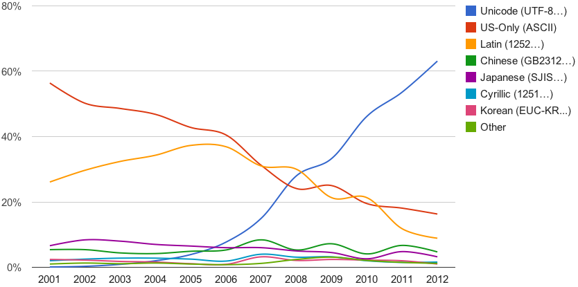
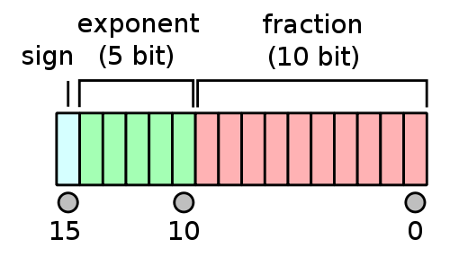
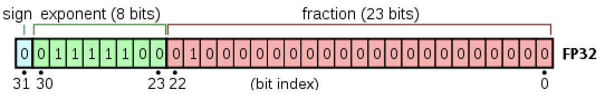
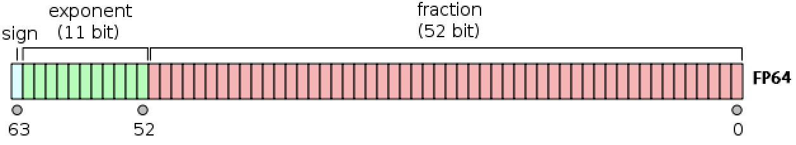
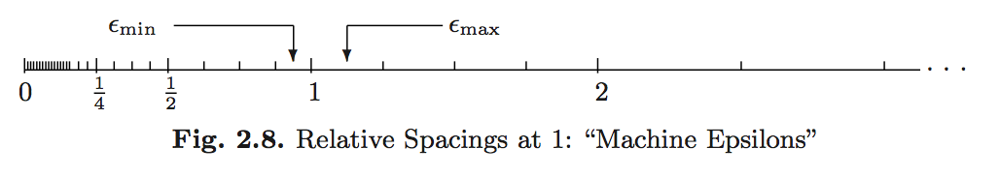

<!-- Requires 'collapse-output' quarto package: https://github.com/mcanouil/quarto-collapse-output --> 

```{r}
#| vscode: {languageId: r}
#| output-fold: true
sessionInfo()
```


### Required R packages

```{r}
#| tags: []
#| vscode: {languageId: r}
#| output-fold: true
# Dig into the internal representation of R objects
library(lobstr)  # if not installed, use install.packages('lobstr')
# For unsigned integers
library(uint8) # devtools::install_github('coolbutuseless/uint8')
# For bitstrings
library(pryr)   # devtools::install_github("hadley/pryr")
# For big integers
library(gmp)
# For single precision floating point numbers
library(float)
library(Rcpp)
```

## Units of computer storage

Humans use decimal digits (why?)\
Computers use binary digits (why?)

* *Bit* = binary digit (coined by statistician [John Tukey](https://en.wikipedia.org/wiki/Bit#History)).  
* *byte* = 8 bits.
* KB = kilobyte = $10^3$ bytes; KiB = kibibyte = $2^{10}$ bytes.  
* MB = megabyte = $10^6$ bytes; MiB = mebibyte = $2^{20}$ bytes.
* GB = gigabyte = $10^9$ bytes. Typical RAM size.  
* TB = terabyte = $10^{12}$ bytes. Typical hard drive size. Size of NYSE each trading session.    
* PB = petabyte = $10^{15}$ bytes.  
* EB = exabyte = $10^{18}$ bytes. Size of all healthcare data in 2011 is ~150 EB.    
* ZB = zetabyte = $10^{21}$ bytes. 

R function `lobstr::obj_size()` shows the amount of memory (in bytes) used by an object. (This is a better version of the built-in `utils::object.size()`

```{r}
#| tags: []
#| vscode: {languageId: r}
#| output-fold: true
x <- 100
lobstr::obj_size(x)
y <-c(20, 30)
lobstr::obj_size(y)
z <- as.matrix(runif(100 * 100), nrow=100)  # 100 x 100 random matrix
lobstr::obj_size(z)
```

Print all variables in workspace and their sizes:

```{r}
#| tags: []
#| vscode: {languageId: r}
#| output-fold: true
sapply(ls(), function(z, env=parent.env(environment())) obj_size(get(z, envir=env)))
```

## Storage of Characters

* Plain text files are stored in the form of characters: `.jl`, `.r`, `.c`, `.cpp`, `.ipynb`, `.html`, `.tex`, ...  
* ASCII (American Code for Information Interchange): 7 bits, only $2^7=128$ characters.  

```{r}
#| vscode: {languageId: r}
#| output-fold: true
# integers 0, 1, ..., 127 and corresponding ascii character
sapply(0:127, intToUtf8)
```

* Extended ASCII: 8 bits, $2^8=256$ characters.  

```{r}
#| vscode: {languageId: r}
#| output-fold: true
# integers 128, 129, ..., 255 and corresponding extended ascii character
sapply(128:255, intToUtf8)
```

* Unicode: UTF-8, UTF-16 and UTF-32 support many more characters including foreign characters; last 7 digits conform to ASCII. 

* [UTF-8](https://en.wikipedia.org/wiki/UTF-8) is the current dominant character encoding on internet.  



Source: [Google Blog](https://googleblog.blogspot.com/2012/02/unicode-over-60-percent-of-web.html)

```{r}
#| vscode: {languageId: r}
#| output-fold: true
st <-  "\uD1B5\uACC4\uACC4\uC0B0"
st
```

## Integers: fixed-point number system

* Fixed-point number system is a computer model for integers $\mathbb{Z}$. 
    - **Remember** that computer memory is finite whereas the cardinality of $\mathbb{Z}$ is (countably) infinite.
    - *Any* representation of numbers in computer *has to be* an approximation.

* The number $M$ of bits and method of representing negative numbers vary from system to system. 
    - The `integer` type in R has $M=32$ (packages such as ‘bit64’support 64 bit integers). 
        + <https://www.r-bloggers.com/r-in-a-64-bit-world/>
    - C has (`unsigned`) `char`, `int`, `short`, `long` (and `long long`), whose sizes depend on the machine.
    - Matlab has `(u)int8`, `(u)int16`, `(u)int32`, `(u)int64`.  

### Unsigned integers

* Model for $\mathbb{N} \cup \{0\}$.
* For unsigned integers, the range is $[0,2^M-1]$.
* R does not support unsigned integers natively (will see `uint8` package later). In most other languages:

| Type        | Min           | Max  |
| ------------- |:-------------:|:------|
|UInt8	|0	|255|
|UInt16	|0	|65535|
|UInt32	|0	|4294967295|
|UInt64	|0	|18446744073709551615|
|UInt128	|0	|340282366920938463463374607431768211455|

### Signed integers

* Model of $\mathbb{Z}$. Can do subtraction.

* First bit ("most significant bit" or MSB) is the sign bit.  
    - `0` for nonnegative numbers
    - `1` for negative numbers  
    
* **Two's complement representation** for negative numbers. 
    - Set the sign bit to 1  
    - Negate (`0`->`1`, `1`->`0`) the remaining bits
    - Add to `1` to the result  
    - Two's complement representation of a negative integer $x$ is the same as the unsigned integer $2^M - x$.

```{r}
#| vscode: {languageId: r}
#| output-fold: true
class(5L)  # postfix `L` means integer in R
pryr::bits(5L)
pryr::bits(-5L)
pryr::bits(2L * 5L) # shift bits of 5 to the left (why?)
pryr::bits(2L * -5L); # shift bits of -5 to left 
```

* Two's complement representation respects modular arithmetic nicely.  
    Addition of any two signed integers are just bitwise addition, possibly modulo $2^M$
    - $M=4$ case:
    
    

Source: [Signed Binary Numbers, Subtraction and Overflow](http://users.dickinson.edu/~braught/courses/cs251f02/classes/notes07.html) by Grant Braught

* **Range** of representable integers by $M$-bit **signed integer** is $[-2^{M-1},2^{M-1}-1]$:

```{r}
#| vscode: {languageId: r}
#| output-fold: true
.Machine$integer.max  # R uses 32-bit integer
```

In most other languages,

| Type        | Min           | Max  |
| ------------- |--------------:|:------|
|Int8	|	-128|127|
|Int16	|-32768	|32767|
|Int32	|-2147483648	|2147483647|
|Int64	|-9223372036854775808	|9223372036854775807|
|Int128	|-170141183460469231731687303715884105728	|170141183460469231731687303715884105727|

### Overflow and underflow for integer arithmetic

R reports `NA` for integer overflow and underflow.  

```{r}
#| vscode: {languageId: r}
#| output-fold: true
# The largest integer R can hold
.Machine$integer.max 
```

```{r}
#| vscode: {languageId: r}
#| output-fold: true
M <- 32
big <- 2^(M-1) - 1
as.integer(big)
```

```{r}
#| vscode: {languageId: r}
#| output-fold: true
.Machine$integer.max + 1L
```

`unit8` outputs the result according to modular arithmetic. So does C and Julia.

```{r}
#| vscode: {languageId: r}
#| output-fold: true
uint8::as.uint8(255) + uint8::as.uint8(1)
uint8::as.uint8(250) + uint8::as.uint8(15)
```

Package `gmp` supports big integers with arbitrary precision.

```{r}
#| vscode: {languageId: r}
#| output-fold: true
gmp::as.bigz(.Machine$integer.max ) + gmp::as.bigz(1L)
```

## Real numbers: floating-point number system

Floating-point number system is a computer model for the real line $\mathbb{R}$.

* Most computer systems adopt the [IEEE 754 standard](https://en.wikipedia.org/wiki/IEEE_floating_point), established in 1985, for floating-point arithmetics.  
For the history, see an [interview with William Kahan](http://www.cs.berkeley.edu/~wkahan/ieee754status/754story.html).

* In the scientific notation, a real number is represented as
$$
\pm d_1.d_2d_3 \cdots d_p \times b^e, \quad 0 \le d_i < b.
$$
Humans use the _base_ $b=10$ and _digits_ $d_i=0, 1, \dotsc, 9$.\
    In computer, the base is $b=2$ and the digits $d_i$ are 0 or 1.

* **Normalized** vs **denormalized** numbers. For example, decimal number 18 is
$$ +1.0010 \times 2^4 \quad (\text{normalized})$$
or, equivalently,
$$ +0.1001 \times 2^5 \quad (\text{denormalized}).$$

* In the floating-number system, computer stores 
    - sign bit  
    - the _fraction_ (or _mantissa_, or _significand_) of the **normalized** representation
    - the actual exponent _plus_ a bias

* R supports *double precesion* floating point numbers (see below) via `double`. 

* C supports floating point types `float` and `double`, where in most systems `float` corresponds to single precision while `double` corresponds to double precision.

* Python supports built-in floating point type `float`, usually implemented using `double` in *C*; information about the precision and internal representation of floating-point numbers for the machine on which Python program is running is available in `sys.float_info`.  <https://docs.python.org/3/library/stdtypes.html#numeric-types-int-float-complex>

* Julia provides `Float16` (half precision, implemented in software using `Float32`), `Float32` (single precision), `Float64` (double precision), and `BigFloat` (arbitrary precision).

> R has no single precision data type. All real numbers are stored in double precision format. The functions `as.single` and `single` are identical to `as.double` and `double` except they set the attribute `Csingle` that is used in the `.C` and `.Fortran` interface, and they are intended only to be used in that context. [R Documentation](https://stat.ethz.ch/R-manual/R-devel/library/base/html/double.html)

* For ease of exposition, we begin with half precision.

### Half precision (Float16)



Source: <https://en.wikipedia.org/wiki/Half-precision_floating-point_format>
    
- In Julia, `Float16` is the type for half precision numbers.

- MSB is the sign bit.  

- 10 significand bits (**fraction**=**mantissa**), hence $p=11$ (why?)

- 5 exponent bits: $e_{\max}=15$, $e_{\min}=-14$, **bias**=15 = $01111_2$ for encoding:
    + $e_{\min} = \mathbf{00001_2} - 01111_2 = -14_{10}$
    + $e_{\max} = \mathbf{11110_2} - 01111_2 = 15_{10}$

- $e_{\text{min}}-1$ and $e_{\text{max}}+1$ are reserved for special numbers.  

- range of **magnitude**: $10^{\pm 4}$ in decimal because $\log_{10} (2^{15}) \approx 4$.  

- **Precision**: $\log_{10}2^{11} \approx 3.311$ decimal digits. 

$$
(value) = (-1)^{b_{15}}\times 2^{(\sum_{j=1}^5 b_{15-j}2^{5-j}) - 15} \times \left( 1 + \sum_{i=1}^{10}\frac{b_{10-i}}{2^i}\right)
$$

```Julia
# This is Julia
println("Half precision:")
@show bitstring(Float16(5)) # 5 in half precision
@show bitstring(Float16(-5)); # -5 in half precision
```

```
Half precision:
bitstring(Float16(5)) = "0100010100000000"
bitstring(Float16(-5)) = "1100010100000000"
```

### Single precision (Float32, or `float`)



Source: <https://en.wikipedia.org/wiki/Single-precision_floating-point_format>

- In C, `float` is the type for single precision numbers for most systems.
- In Julia, `Float32` is the type for single precision numbers.  
- In R, single precision is not supported natively. We use the following workaround:

```{r}
#| vscode: {languageId: r}
#| output-fold: true
# Homework: figure out how this C++ code works
Rcpp::cppFunction('int float32bin(double x) {
    float flx = (float) x; 
    unsigned int binx = *((unsigned int*)&flx); 
    return binx; 
}')
```

- MSB is the sign bit.  

- 23 significand bits ($p=24$).  

- 8 exponent bits: $e_{\max}=127$, $e_{\min}=-126$, **bias**=127.  

- $e_{\text{min}}-1$ and $e_{\text{max}}+1$ are reserved for special numbers.  

- range of **magnitude**: $10^{\pm 38}$ in decimal because $\log_{10} (2^{127}) \approx 38$.

- **precision**: $\log_{10}(2^{24}) \approx 7.225$ decimal digits.  

```{r}
#| vscode: {languageId: r}
#| output-fold: true
message("Single precision:")
pryr::bits(float32bin(5)) # 5 in single precision
pryr::bits(float32bin(-5)) # -5 in single precision
```

### Double precision (Float64, or `double`)



Source: <https://en.wikipedia.org/wiki/Double-precision_floating-point_format>

- Double precision (64 bits = 8 bytes) numbers are the dominant data type in scientific computing.

- In C, `double` is the type for double precision numbers for most systems. It is the **default** type for `numeric` values.

- In Julia, `Float64` is the type for double precision numbers.    

- In R, `double` is the type for double precision numbers.    

- MSB is the sign bit.  

- 52 significand bits ($p=53$).

- 11 exponent bits: $e_{\max}=1023$, $e_{\min}=-1022$, **bias**=1023.  

- $e_{\text{min}}-1$ and $e_{\text{max}}+1$ are reserved for special numbers.  

- range of **magnitude**: $10^{\pm 308}$ in decimal because $\log_{10} (2^{1023}) \approx 308$.  

- **precision** to the $\log_{10}(2^{53}) \approx 15.95$ decimal point.

```{r}
#| vscode: {languageId: r}
#| output-fold: true
message("Double precision:")
pryr::bits(5)    # 5 in double precision
pryr::bits(-5)   # -5 in double precision
```

### Special floating-point numbers

- Exponent $e_{\max}+1$ plus a zero mantissa means $\pm \infty$.

```{r}
#| vscode: {languageId: r}
#| output-fold: true
pryr::bits(Inf)    # Inf in double precision
pryr::bits(-Inf)   # -Inf in double precision
```

- Exponent $e_{\max}+1$ plus a nonzero mantissa means `NaN`. `NaN` could be produced from `0 / 0`, `0 * Inf`, ...  

- In general `NaN ≠ NaN` bitwise. Test whether a number is `NaN` by `is.nan` function.  

```{r}
#| vscode: {languageId: r}
#| output-fold: true
pryr::bits(0 / 0)  # NaN
pryr::bits(0 * Inf) # NaN
```

- Exponent $e_{\min}-1$ with a zero mantissa represents the real number 0 ("exact zero").  
    + Why do we need an exact zero?

```{r}
#| vscode: {languageId: r}
#| output-fold: true
pryr::bits(0.0)  # 0 in double precision 
```

- Exponent $e_{\min}-1$ with a nonzero mantissa are for numbers less than $b^{e_{\min}}$.  
    Numbers are _denormalized_ in the range $(0,b^{e_{\min}})$ -- **gradual underflow**. 
- For example, in half-precision, $e_{\min}=-14$ but $2^{-24}$ is represented by $0.0000000001_2 \times 2^{-14}$.
- In single precision, $e_{\min}=-126$ but $2^{-149}$ is represented by $0.00000000000000000000001_2 \times 2^{-126}$.

```{r}
#| vscode: {languageId: r}
#| output-fold: true
2^(-126)  # emin=-126
pryr::bits(float32bin(2^(-126)))
2^(-149)  # denormalized
pryr::bits(float32bin(2^(-149)))
```

### Rounding

* Rounding is necessary whenever a number has more than $p$ significand bits. Most computer systems use the default IEEE 754 _round to nearest, ties to even_ mode: 

* *Round to nearest*: for example, the number 1/10 cannot be represented accurately as a (binary) floating point number:
$$ 0.1 = 1.10011001\dotsc_2 \times 2^{-4} $$

```{r}
#| vscode: {languageId: r}
#| output-fold: true
pryr::bits(float32bin(0.1)) # single precision, 1001 gets rounded to 101(0)
```

In single precision, the number

`1.1001 1001 1001 1001 1001 1001 1001 ...`

falls between

`1.1001 1001 1001 1001 1001 100`

and

`1.1001 1001 1001 1001 1001 101`.

The midway between these two numbers is

`1.1001 1001 1001 1001 1001 1001 0000 0...`

Hence $0.1_{10}$ is closer to `1.1001 1001 1001 1001 1001 101`.

* *Ties to even*: if the number falls midway, it is rounded to the nearest value with an even least significant digit.

* For example, consider the case that the precision is 4 binary digits


Exact number | Rounded value | Remainder bits |
-------------|---------------|----------------|
1.000011*2^1 | 1.000*2^1     | 011 -> round down
1.000110*2^1 | 1.001*2^1     | 110 -> round up
1.011100*2^1 | 1.100*2^1     | 100 -> round up (*)
1.010100*2^1 | 1.010*2^1     | 100 -> round down (**)


- In the third example (*), `1.011 100` is precisely midway between `1.011` and `1.100`. The ties to even rule chooses `1.100`, i.e., the representation whose the least significant bit is zero.

- In the fourth example (**), `1.010 100` is also precisely midway between `1.010` and `1.011`. The ties to even rule now chooses to round down to `1.010`.

- To summarize, if the remainder bits below the precision are `1000 0...`, then the ties to even rule applies.

### Errors

Rounding (more fundamentally, finite precision) incurs errors in floating porint computation. If a real number $x$ is represented by a floating point number $[x]$, then

* Absolute error
$$
    | [x] - x |
$$

* Relative error
$$
    \frac{| [x] - x |}{|x|}
$$
(if $x \neq 0$).

Of course, we want to ensure that the error after a computation is small.

### Machine epsilons

- Floating-point numbers do not occur uniformly over the real number line
    
    
Source: [What you never wanted to know about floating point but will be forced to find out](http://www.volkerschatz.com/science/float.html)
    
- Same number of representible numbers in $(2^i, 2^{i+1}]$ as in $(2^{i+1}, 2^{i+2}]$. Within an interval, they are uniformly distributed.
    
- **Machine epsilons** are the spacings of numbers around 1: 
    + $\epsilon_{\max}$ = (smallest positive floating point number that added to 1 will give a result different from 1) = $\frac{1}{2^p} + \frac{1}{2^{2p-1}}$
    + $\epsilon_{\min}$ = (smallest positive floating point number that subtracted from 1 will give a result different from 1) = $\frac{1}{2^{p+1}} + \frac{1}{2^{2p}}$.
    
    

Source: *Computational Statistics*, James Gentle, Springer, New York, 2009.
    
- Any real number in the interval $\left[1 - \frac{1}{2^{p+1}}, 1 + \frac{1}{2^p}\right]$ is represented by a floating point number $1 = 1.00\dotsc 0_2 \times 2^0$ (recall ties to even).

- Adding $\frac{1}{2^p}$ to 1 won't reach the next representable floating point number  $1.00\dotsc 01_2 \times 2^0 = 1 + \frac{1}{2^{p-1}}$. Hence $\epsilon_{\max} > \frac{1}{2^p} = 1.00\dotsc 0_2 \times 2^{-p}$.

- Adding the floating point number next to $\frac{1}{2^p} = 1.00\dotsc 0_2 \times 2^{-p}$ to 1 WILL result in $1.00\dotsc 01_2 \times 2^0 = 1 + \frac{1}{2^{p-1}}$, hence $\epsilon_{\max} = 1.00\dotsc 01_2 \times 2^{-p} = \frac{1}{2^p} + \frac{1}{2^{p+p-1}}$.

- Subtracting $\frac{1}{2^{p+1}}$ from 1 results in $1-\frac{1}{2^{p+1}} = \frac{1}{2} + \frac{1}{2^2} + \dotsb + \frac{1}{2^p} + \frac{1}{2^{p+1}}$, which is represented by the floating point number $1.00\dotsc 0_2 \times 2^{0} = 1$ by the "ties to even" rule. Hence $\epsilon_{\min} > \frac{1}{2^{p+1}}$.

- The smallest positive floating point number larger than $\frac{1}{2^{p+1}}$ is $\frac{1}{2^{p+1}} + \frac{1}{2^{2p}}=1.00\dotsc 1_2 \times 2^{-p-1}$. Thus $\epsilon_{\min} = \frac{1}{2^{p+1}} + \frac{1}{2^{2p}}$.

### Machine precision

* Machine epsilon is often called the machine precision.

* If a positive real number $x \in \mathbb{R}$ is represented by $[x]$ in the floating point arithmetic, then 
$$
    [x] = \left( 1 + \sum_{i=1}^{p-1}\frac{b_{i+1}}{2^i}\right) \times 2^e.
$$
Thus $x - \frac{2^e}{2^p} < [x] \le x + \frac{2^e}{2^p}$, 
and
$$
    \begin{split}
    \frac{| x - [x] |}{|x|} &\le \frac{2^e}{2^p|x|} \le \frac{2^e}{2^p}\frac{1}{[x]-2^e/2^p} \\
                            &\le \frac{2^e}{2^p}\frac{1}{2^e(1-1/2^p)}  \quad (\because [x] \ge 2^e) \\
                            &\le \frac{2^e}{2^p}\frac{1}{2^e}(1 + \frac{1}{2^{p-1}}) \\
                            &= \frac{1}{2^p} + \frac{1}{2^{2p-1}} = \epsilon_{\max}.
    \end{split}
$$
That is, the **relative error** of the floating point representation $[x]$ of real number $x$ is bounded by $\epsilon_{\max}$.

```{r}
#| vscode: {languageId: r}
#| output-fold: true
options(digits=20)

print(2^(-53) + 2^(-105))   # epsilon_max for double
print(1.0 + 2^(-53))
print(1.0 + (2^(-53) + 2^(-105)))
print(1.0 + 2^(-53) + 2^(-105))  # why is the result?  See "Catastrophic cancellation"

print(as.double(float::fl(2^(-24) + 2^(-47))))  # epsilon_max for float
print(as.double(float::fl(1.0) + float::fl(2^(-24))))
print(as.double(float::fl(1.0) + float::fl(2^(-24) + 2^(-47))))
```

```{r}
#| vscode: {languageId: r}
#| output-fold: true
print(2^(-54) + 2^(-106))  # epsilon_min for double
print(1 - (2^(-54) + 2^(-106)))
pryr::bits(1.0)
pryr::bits(1 - (2^(-54) + 2^(-106)))
```

* In R, the variable `.Machine` contains numerical characteristics of the machine. `double.neg.eps` is our $\epsilon_{\max}$.

```{r}
#| vscode: {languageId: r}
#| output-fold: true
.Machine
```

### Floating point arithmetic

The IEEE 754 standard guarantees that the arithmetic operations involving floating point numbers is so that the operation result in the floating point representation of the exact arithmetric of the involved floating point numbers. For example, suppose $x$ and $y$ are two exact real numbers. Let $[x]$ and $[y]$ be their floating point representation, after the appropriate rounding. Then, the addition of these two numbers is computed like the following.
$$
\begin{split}
    z &= [x] + [y] \quad \text{(exact arithmetric)}
    \\
    z &\gets [z] \quad \text{(rounding)}
\end{split}
$$

### Overflow and underflow of floating-point number

* For double precision, the range is $\pm 10^{\pm 308}$. In most situations, underflow (magnitude of result is less than $10^{-308}$) is preferred over overflow (magnitude of result is larger than $10^{+308}$). Overflow produces $\pm \inf$. Underflow yields zeros or denormalized numbers. 

* E.g., the logit link function is
$$p = \frac{\exp (x^T \beta)}{1 + \exp (x^T \beta)} = \frac{1}{1+\exp(- x^T \beta)}.$$
The former expression can easily lead to `Inf / Inf = NaN`, while the latter expression leads to gradual underflow.

* `.Machine$double.xmax` and `.Machine$double.xmin` functions gives largest and smallest _non-subnormal_ number represented by the given floating point type.

## Catastrophic cancellation

* **Scenario 1**: Addition or subtraction of two numbers of widely different magnitudes: $a+b$ or $a-b$ where $a \gg b$ or $a \ll b$. We lose the precision in the number of smaller magnitude. Consider 
$$\begin{eqnarray*}
    a &=& x.xxx ... \times 2^{30} \\  
    b &=& y.yyy... \times 2^{-30}
\end{eqnarray*}$$
What happens when computer calculates $a+b$? We get $a+b=a$!

```{r}
#| vscode: {languageId: r}
#| output-fold: true
(a <- 2.0^30)
(b <- 2.0^-30)
(a + b == a)
pryr::bits(a)
pryr::bits(a + b)
```

Analysis: suppose we want to compute $x + y$, $x, y > 0$. Let the relative error of $x$ and $y$ be
$$
\delta_x = \frac{[x] - x}{x},
\quad
\delta_y = \frac{[y] - y}{y}
.
$$
What the computer actually calculates is $[x] + [y]$, which in turn is represented by $[ [x] + [y] ]$. The relative error of this representation is
$$
\delta_{\text{sum}} = \frac{[[x]+[y]] - ([x]+[y])}{[x]+[y]}
.
$$
Recall that $|\delta_x|, |\delta_y|, |\delta_{\text{sum}}| \le \epsilon_{\max}$.

We want to find a bound of the relative error of $[[x]+[y]]$ with respect to $x+y$.
Since $|[x]+[y]| = |x(1+\delta_x) + y(1+\delta_y)| \le |x+y|(1+\epsilon_{\max})$, we have
$$
\begin{split}
| [[x]+[y]]-(x+y) | &= | [[x]+[y]] - [x] - [y] + [x] - x + [y] - y | \\
                   &\le | [[x]+[y]] - [x] - [y] | +  | [x] - x | + | [y] - y | \\
                   &\le |\delta_{\text{sum}}([x]+[y])| + |\delta_x x| + |\delta_y y| \\
                   &\le \epsilon_{\max}(x+y)(1+\epsilon_{\max}) + \epsilon_{\max}x + \epsilon_{\max}y \\
                   &\approx 2\epsilon_{\max}(x+y)
\end{split}
$$
because $\epsilon_{\max}^2 \approx 0$. Thus
$$
\frac{| [[x]+[y]]-(x+y) |}{|x+y|} \le 2\epsilon_{\max}
$$
approximately.

* **Scenario 2**: Subtraction of two nearly equal numbers eliminates significant digits.  $a-b$ where $a \approx b$. Consider 
$$\begin{eqnarray*}
    a &=& x.xxxxxxxxxx1ssss  \\
    b &=& x.xxxxxxxxxx0tttt
\end{eqnarray*}$$
The result is $1.vvvvu...u$ where $u$ are unassigned digits.

```{r}
#| vscode: {languageId: r}
#| output-fold: true
olddigits <- options('digits')$digits
options(digits=20)

a <- float::fl(1.2345678) # rounding
pryr::bits(float32bin(as.double(a))) # rounding
b <- float::fl(1.2345677)
pryr::bits(float32bin(as.double(b)))
print(as.double(a - b)) # correct result should be 1f-7
pryr::bits(float32bin(as.double(a - b)))   # must be 1.0000...0 x 2^(-23)
print(1/2^23)

options(digits=olddigits)
```

Analysis: Let
$$
[x] = 1 + \sum_{i=1}^{p-2}\frac{d_{i+1}}{2^i} + \frac{1}{2^{p-1}},
\quad
[y] = 1 + \sum_{i=1}^{p-2}\frac{d_{i+1}}{2^i} + \frac{0}{2^{p-1}}
.
$$

* $[x]-[y] = \frac{1}{2^{p-1}} = [[x]-[y]]$.

* The true difference $x-y$ may lie anywhere in $(0, \frac{1}{2^{p-2}}+\frac{1}{2^{2p}}]$.

* Relative error 
$$
\frac{|x-y -[[x]-[y]]|}{|x-y|}
$$
is unbounded -- no guarantee of any significant digit!

* Implications for numerical computation
    - Rule 1: add small numbers together before adding larger ones  
    - Rule 2: add numbers of like magnitude together (paring). When all numbers are of same sign and similar magnitude, add in pairs so each stage the summands are of similar magnitude  
    - Rule 3: avoid substraction of two numbers that are nearly equal
        + Example: in solving quadratic equation $ax^2 + bx + c = 0$ with $b > 0$ and $b^2 - 4ac > 0$, the roots are
        $$
            x = \frac{-b \pm \sqrt{b^2 - 4ac}}{2a}
            .
        $$
        If $b \approx \sqrt{b^2 - 4ac}$, then a scenario 2 occurs. A resolution is to compute only one root $x_1 = \frac{-b - \sqrt{b^2 - 4ac}}{2a}$ by the formula, and find the other root $x_2$ using the relation $x_1x_2 = c/a$.

### Algebraic laws

Floating-point numbers may violate many algebraic laws we are familiar with, such associative and distributive laws. See the example in the Machine Epsilon section and HW1.

## Further readings

* Section II.2, [Computational Statistics](https://link.springer.com/book/10.1007%2F978-0-387-98144-4) by James Gentle (2009).

* Sections 1.5 and 2.2, [Applied Numerical Linear Algebra](https://doi.org/10.1137/1.9781611971446) by James W. Demmel (1997).

* [What every computer scientist should know about floating-point arithmetic](https://www.itu.dk/~sestoft/bachelor/IEEE754_article.pdf) by David Goldberg (1991).

